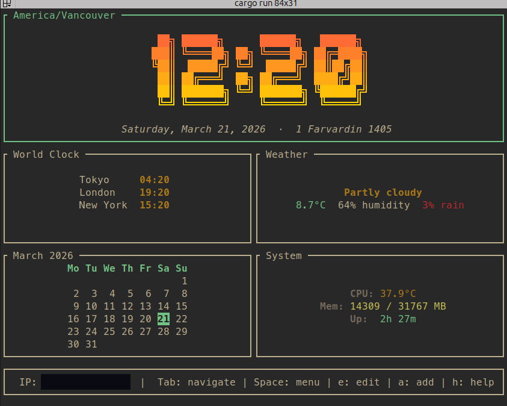
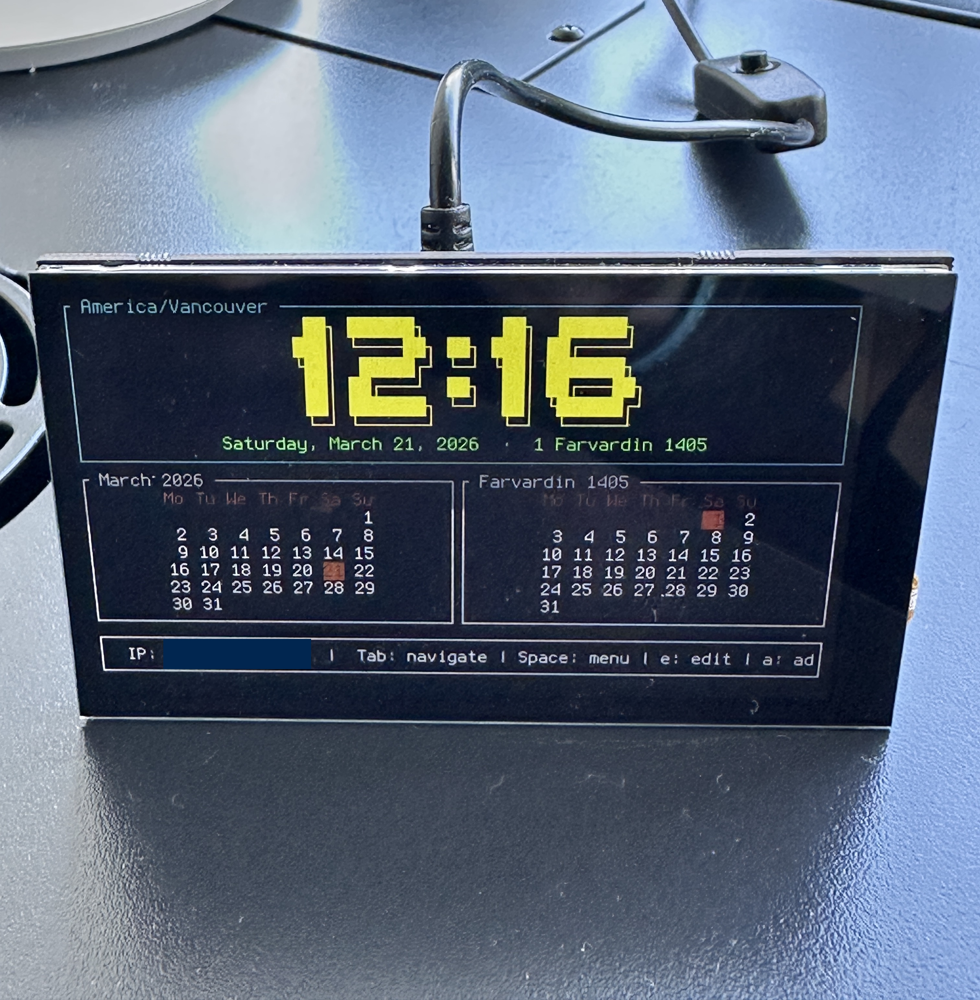

# nexclock

A terminal dashboard clock built with optional components such as world clock, weather, different calendars, and 
basic system stats. Runs fullscreen in any terminal.

I built this primarily for my Raspberry Pi Zero W + HyperPixel 4.0 display as a weekend project, largely with 
Claude Code.

Wanted to see how much more productive I would be vs. my 
[last similar project](https://github.com/kavehtehrani/pihole_lcd), 
before the arrival of  AI coding.

Sample terminal look


And on top of my homelab



## Components

- **Clock** - Large display with gradient colors, or compact text clocks for secondary timezones
- **World Clock** - Multiple timezones in a single panel
- **Weather** - Current conditions via Open-Meteo (no API key needed)
- **Calendar** - Gregorian plus 14 alternative calendar systems (Persian, Islamic, Hebrew, Chinese, etc.) via the AnyCalendar API
- **System Stats** - CPU, memory, disk, and uptime

## Layout

Components sit on a CSS Grid-style layout. You define rows, columns, and optional size weights in the config. Components can span multiple cells, a clock can take the full top row while four panels split the space below it.

Everything is configurable from the TUI itself: add/remove components, move and resize them, change colors, span full rows, toggle visibility. Changes persist to `~/.config/nexclock/config.toml` on exit.

## Config

Default config lives at `~/.config/nexclock/config.toml`. Logs go to `~/.local/share/nexclock/`.

## Tech Stack

**Rust** - This runs on a Pi Zero W. Rust gives us a ~3MB binary with no runtime overhead.

**ratatui + crossterm** - The standard Rust TUI stack. ratatui handles layout and rendering, crossterm handles terminal I/O. Works on any terminal, no GPU needed. I've been using ratatui a lot recently and really love building TUIs with it.

**cfonts** - I was surprised to see that ratatui doesn't actually implement some sort of font size. Guess it makes sense 
given that font size is more of a terminal thing, but still would've been nice to have some sort of option. After a lot of searching, I found
[cfont](https://github.com/dominikwilkowski/cfonts) which seem to have done the job but I'm still not really loving it. If you know 
of a better solution please let me know! 

**chrono + chrono-tz** - Time handling with full IANA timezone support.

## Building

```sh
cargo build --release
```

Cross-compile for Raspberry Pi:

```sh
# Install the target
rustup target add arm-unknown-linux-gnueabihf

# Build
cargo build --release --target arm-unknown-linux-gnueabihf
```
